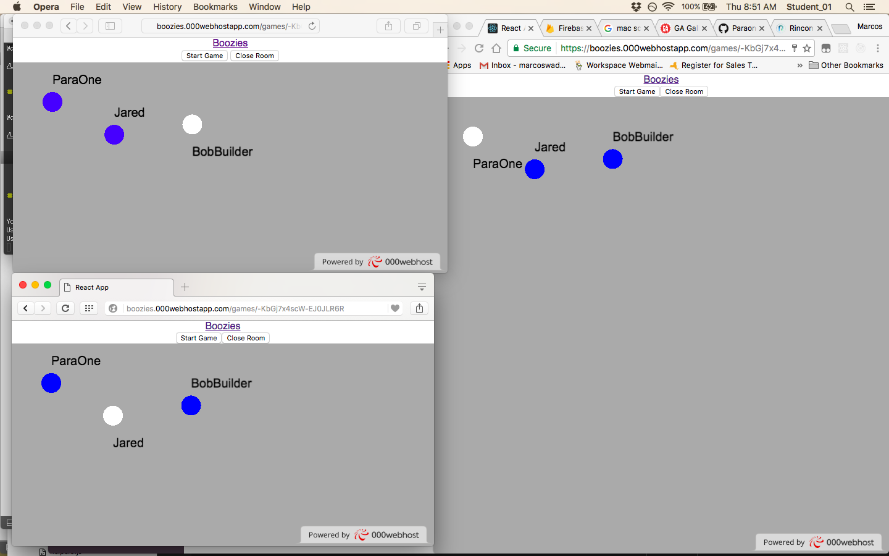
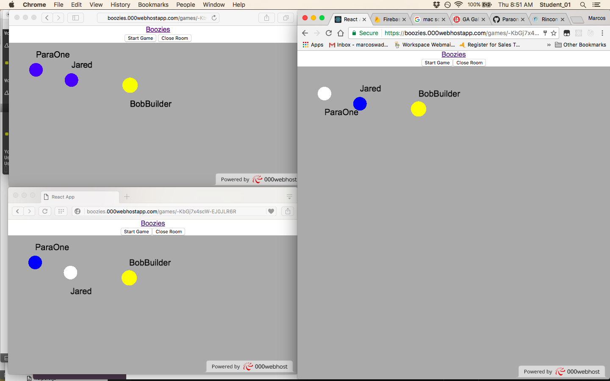
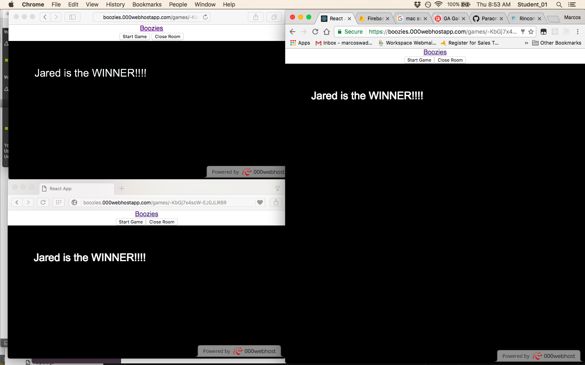

# Boozies

Boozies is a 2D multiplayer game based on the classic game 
Tag. Users can login and create gamerooms. Others can join 
a created room. When players are ready you hit the start 
button and the game begins. One person is chosen at random
to be "it". The game continues in a help-tag fashion. players
tag other players until there is only one who is not "it".
That player wins the game. 3 players is the minimum amount of
players needed to play a successful game.

Screen Shots:

Ready State

BobBuilder has the boozies!

BobBuilder caught ParaOne
Jared Wins!

Tech Used:

	Frameworks:

	-ReactJS https://facebook.github.io/react/

	APIs:

	-Firebase https://firebase.google.com/

	Runtime Environment:

	-Apache

	Dependencies:

	-pixi.js http://www.pixijs.com/
	-firebase https://firebase.google.com/
	-redux http://redux.js.org/
	-react-redux https://github.com/reactjs/react-redux
	-react-router 

Approach:

	1. First steps where setting up redux and firebase to create
	user accounts.
	2. Next was to implement pixi.js to create a gameroom.
	3. Finally game logic implementation

Installation:

	go to: 

	https://boozies.000webhostapp.com

Unsolved Problems:

	-There are some bugs when players leave a room and 
	return to lobby.

	-finish CRUD Update and Desroy for users.
	
	-I would like to change primitive graphics to 
	animated sprites

	-I would like to implement a single player and 2-player mode

	-Site is in critical need of styling.

MVP:

	An online multiplayer game.
	Deployed at boozies.000webhost.com
	Users and games stored in database
	Create games UI using react and pixi.js

User Stories:

	The user of this app is someone who enjoys mutiplayer games
	with friends. User is able to create an account and chat with
	friends.

Special thanks to:

	https://github.com/kittykatattack/learningPixi

	http://www.rinconstrategies.io/using-react-and-pixijs.html

	http://wesbos.com/

	Jared

